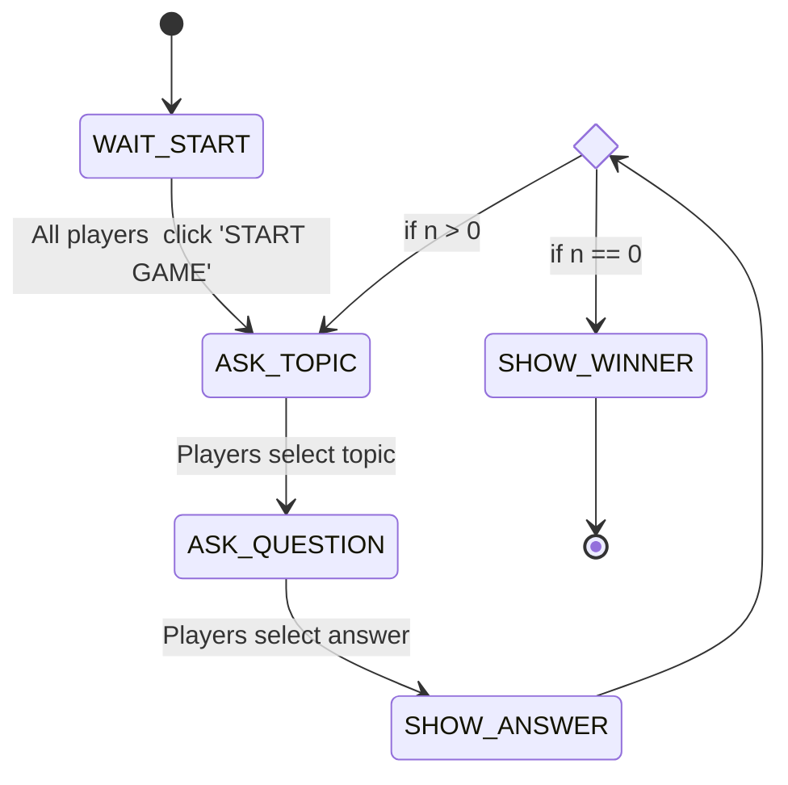
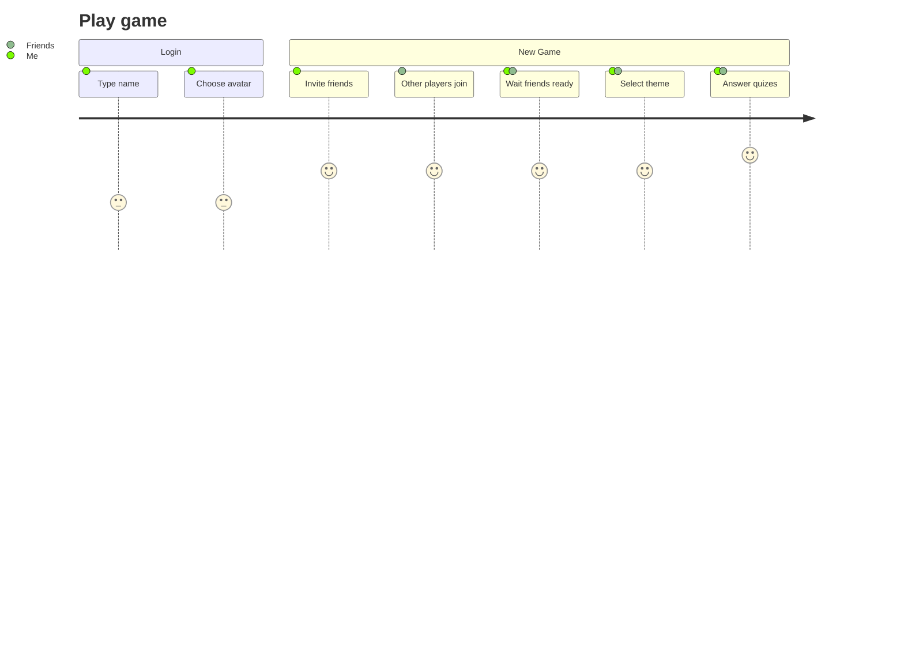
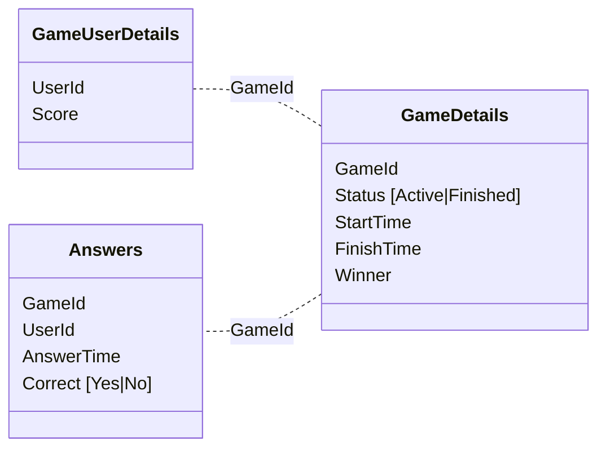

## Game state diagram

## User Journey

## Storage

### Game table

#### Game details

| GameId | Entity        | StartTime        | FinishTime       | Round |
|--------|---------------|------------------|------------------|-------|
| 1321   | `GAME#ACTIVE` | 2022-10-11T11:02 | 2022-10-11T22:04 | 1     |

#### Game round details

| GameId | Entity        | StartTime        | FinishTime       | Round |
|--------|---------------|------------------|------------------|-------|
| 1321   | `GAME#ACTIVE` | 2022-10-11T11:02 | 2022-10-11T22:04 | 1     |

#### Game history

| GameId | Entity    | StartTime        | FinishTime       | Round |
|--------|-----------|------------------|------------------|-------|
| 1321   | `ROUND#1` | 2022-10-11T11:02 | 2022-10-11T22:04 | 1     |

#### GameUserDetails - user details in game

| GameId | Entity | UserId | Start time       | Score |
|--------|--------|--------|------------------|-------|
| 1321   | `USER` | 323    | 2022-10-11T11:02 | 4.2   |
| 1321   | `USER` | 453    | 2022-10-11T11:02 | 2.0   |
| 1321   | `USER` | 22     | 2022-10-11T11:02 | 7.9   |
